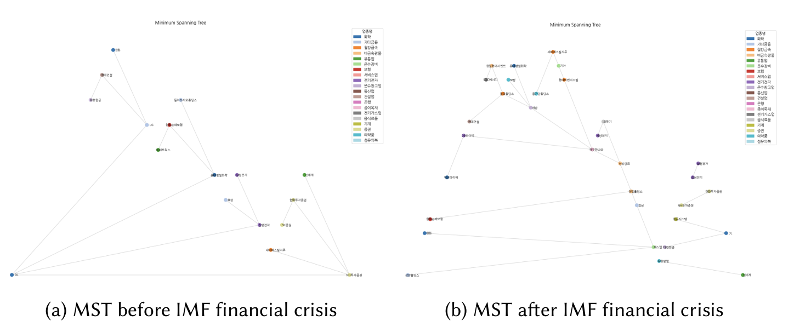
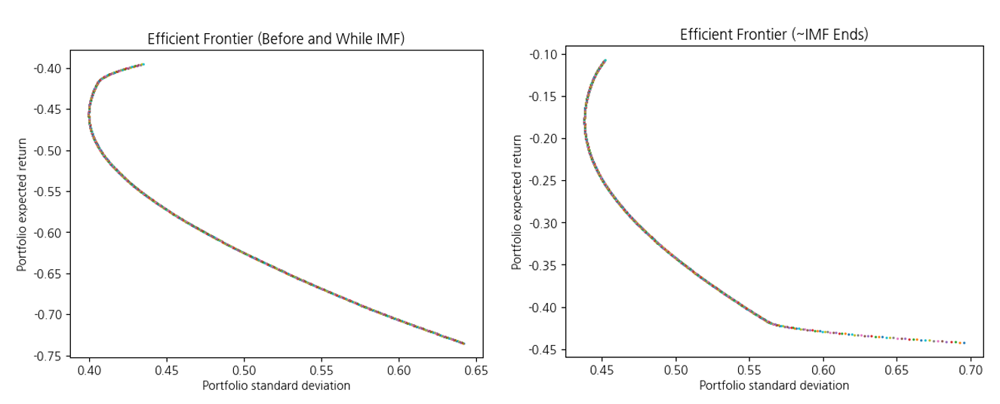

# Analyzing the Network Structure and Dynamic Changes of Major Financial Market Sectors Before and After Economic Crises

This project investigates how major economic crises impact the structure and dynamics of the financial market using network analysis techniques. The study focuses on Korea's KOSPI stock market across three major crises: the 1997 IMF financial crisis, the 2008 subprime mortgage crisis, and the 2020 COVID-19 pandemic.

## 📌 Objectives

- Analyze structural shifts in the Korean financial market before and after economic crises.
- Apply network theory techniques (MST, centrality, community detection).
- Develop portfolio strategies that adapt to changing market conditions.

## 📊 Methodology

- **Data Source**: Daily closing prices of top 100 KOSPI-listed companies.
- **Graph Construction**:
  - Correlation → Distance transformation
  - Network built using significant edges (top 10%)
- **Analytical Methods**:
  - **Minimum Spanning Tree (MST)**
  - **Centrality Analysis** (Degree, Closeness, Betweenness, Eigenvector)
  - **Community Detection** (Louvain method)

### 🔗 MST Visualization Examples

#### 1997 IMF Financial Crisis
- MST structure shifted from financial and securities firms to raw materials and construction.
- Securities firms lost central roles due to restructuring and increased regulation.

*Fig 1. Comparison of MST before and after the IMF financial crisis*

#### 2008 Subprime Mortgage Crisis
- Pre-crisis central nodes were finance companies.
- Post-crisis central nodes included heavy industry and insurance sectors.

*Fig 2. Comparison of MST before and after the Subprime Mortgage crisis*

#### 2020 COVID-19 Pandemic
- Shift from transportation and export-heavy companies to tech, e-commerce, and domestic firms like Naver and Netmarble.

*Fig 3. Comparison of MST before and after COVID-19*

## 💡 Key Findings

- **Crisis Periods = Higher Centrality + Fewer Communities**  
  → Suggests more unified market responses during downturns.
- Securities firms dominated pre-crisis but were replaced by raw material, tech, and domestic sectors afterward.
- Importance of digital and platform-based companies rose significantly post-COVID.

## 📈 Investment Strategy

### Degree-Centrality-Based Sector Definition

- **Hub & Spoke**: Core, highly-connected stocks
- **Chain Link**: Moderately-connected stocks
- **Fringe Player**: Weakly-connected or isolated stocks

These were used to construct portfolios across different crisis phases.

### Efficient Frontier Results (IMF Crisis)

- Portfolio risk-return balance was visualized using efficient frontiers.
- Results showed how optimal asset allocation shifts during crisis vs. recovery.

*Fig 4. Efficient Frontier Before and During IMF (Left) and Until the End of IMF (Right)*

## 🛠 Tools & Technologies

- Python
- NetworkX
- Pandas, NumPy
- Matplotlib, Seaborn

## 🧑‍💻 Authors

- Jaewoong Jeong (jaywoong.jeong@kaist.ac.kr)  
- Hyeongmin Park (mike980409@kaist.ac.kr)  
- Juchan Lee (jclee0109@kaist.ac.kr)  
- Minkyung Choi (minkyungww@kaist.ac.kr)  
(Korea Advanced Institute of Science and Technology)

## 📄 Citation

